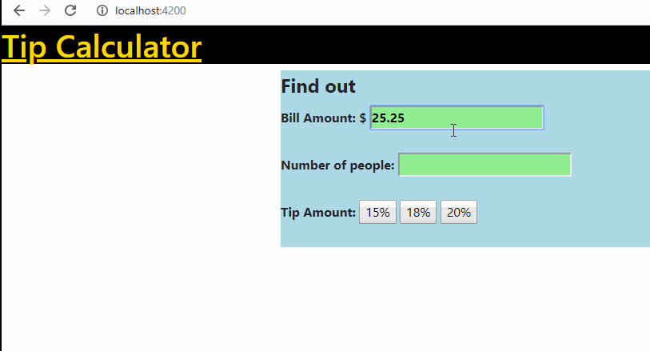

# Tip Calculator

Author: Luis Carazas

This project calculates the total bill for an amount the user inputs

## Time spent
Describe the time you spent on the project.
 * Tutorials, research: 3 hours
 * Coding required stories: 2 hours
 * Optional and extras: 2 hours

## User stories
I was confused as to why my component was not outputting but then I figured out I forgot to put it in brackets in the application.hbs file. After that I mostly spent my time figuring out how to pass the values from my form into my javascript for calculations.

### Required
 * [x] User can enter total bill amount
 * [x] User can choose between at least three tip tiers (e.g. 15%, 18%, 20%) and see the total tip 
 * [x] User can see the total with tip

### Optional

 * [x] Add custom CSS to the calculator inputs
 * [ ] Add a light/dark color theme toggle on the page
 * [ ] User can enter tax amount
 * [x] Page is optimized for the viewport/browser size (i.e. scales to mobile & desktop sizes)
 * [ ] Remember the previous bill amount when the user re-opens the browser
 * [ ] Use [locale specific](https://developer.mozilla.org/en-US/docs/Web/JavaScript/Reference/Global_Objects/NumberFormat) currency and currency separators.

### Extra

 * If the number of people is one, only the total bill amount and tip amount display. If there are more than one then a "Total per person" amount displays also.
 

## GIF Walkthrough

GIF created with [LiceCap](https://www.cockos.com/licecap/).

## Notes & shoutouts

StackOverflow and W3Schools were very kind. 
